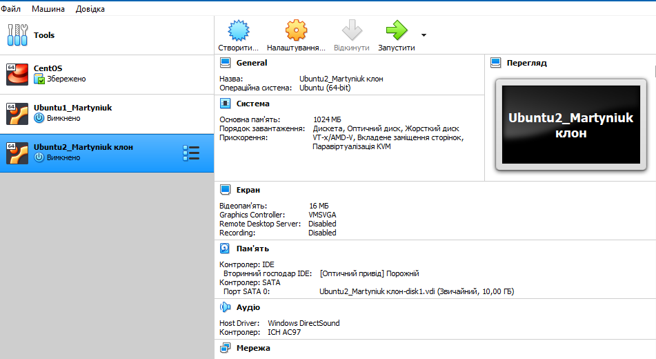
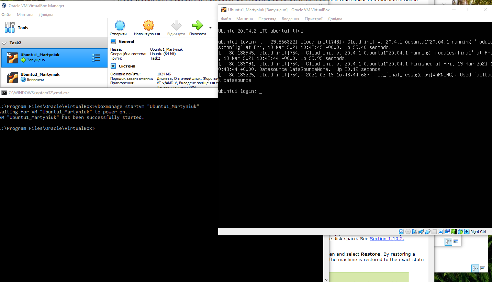
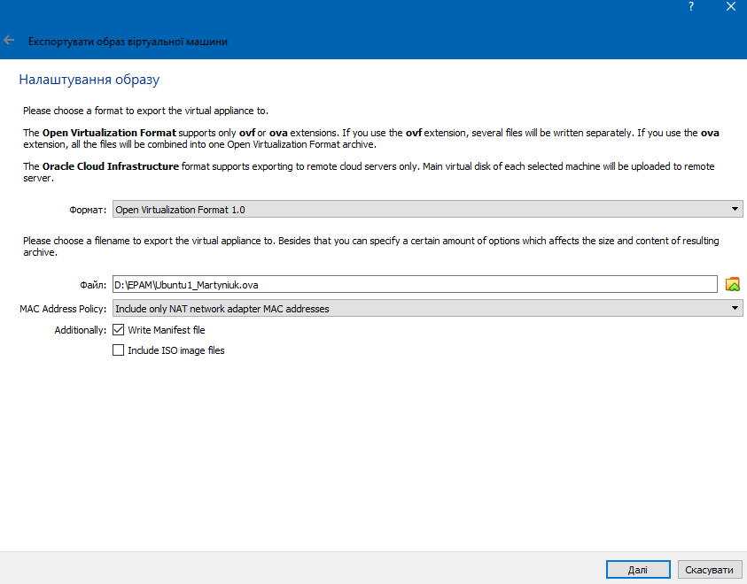
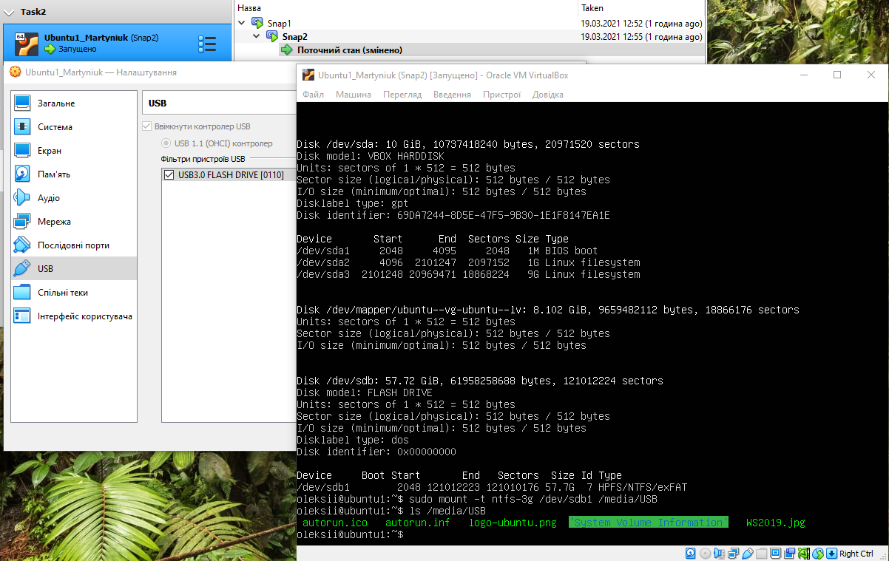
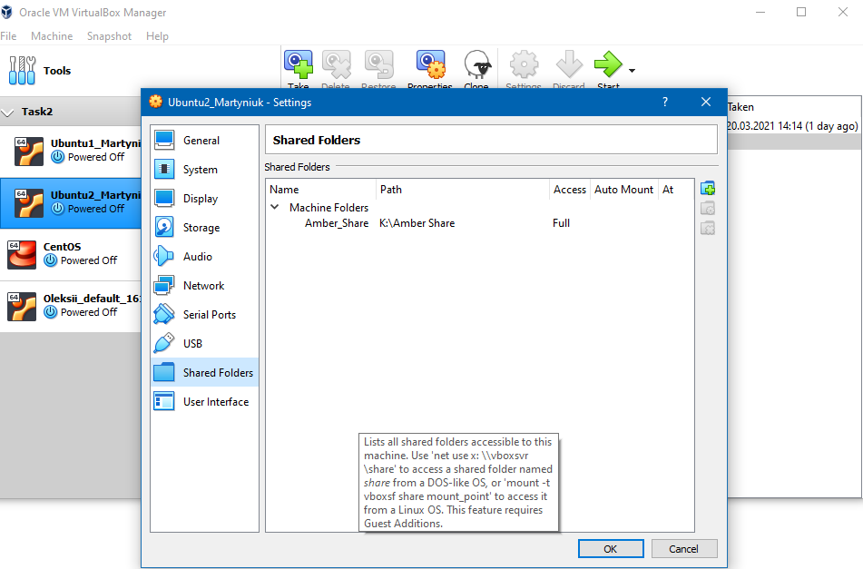
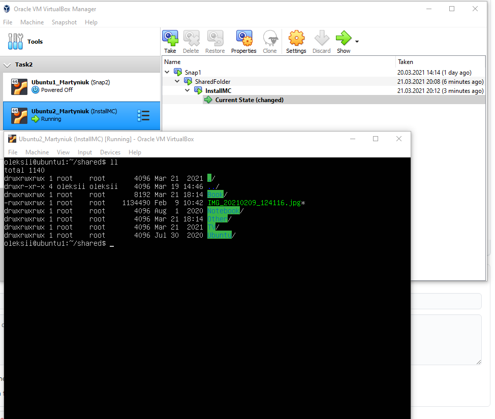
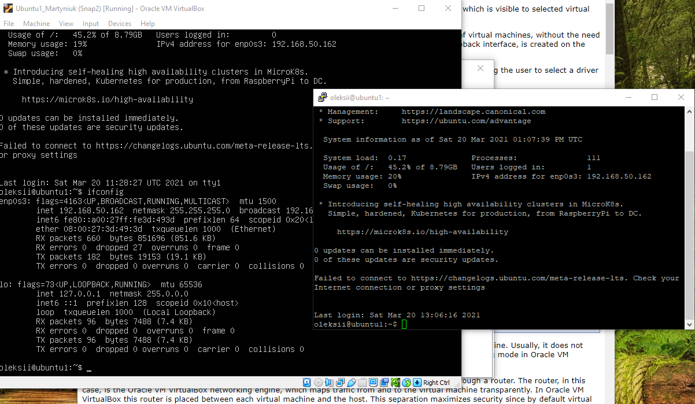
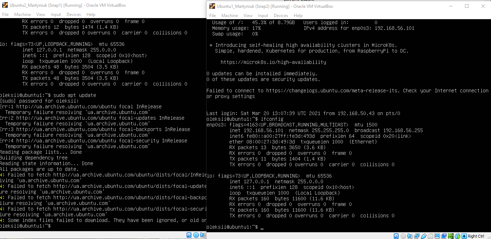
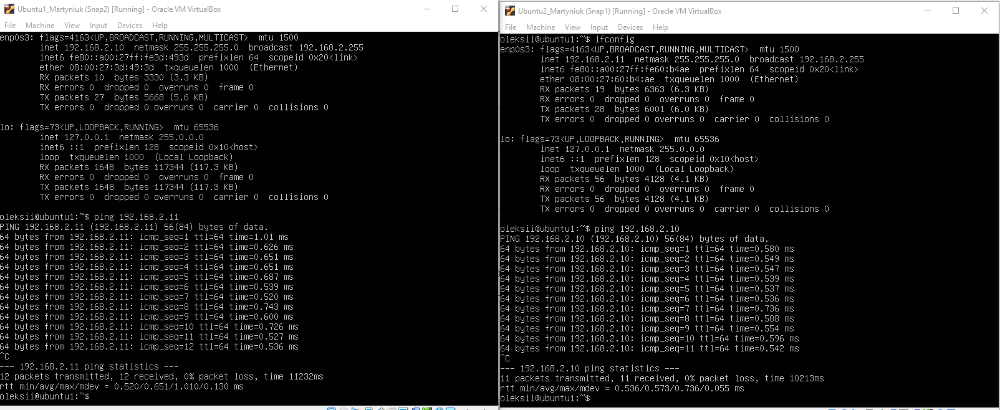
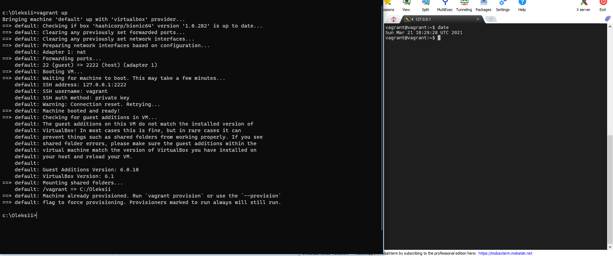

## Task2.1.  
For Task2.1 I created virtual machine in VirtualBox, named it Ubuntu1_Martyniuk and made clone of this VM.
 

 
Learning command line commands for VitrualBox and created group of two VM and name it "Task2".  
  
After this I saved .ova file on disk and import it back to VB. 
  
Then I explored VM configuration options and confirure the USB to connect the USB ports of the host machine to the VM  
  
Then configured shared folder to exchange data between Host system and virtual machine.  
  
  
Then I tryed different network modes for virtual machines.  
<b>Bridge</b>   
  
<b>Host only</b>  
  
<b>Internal</b>  
   
<b>Vagrant</b>  
Then I successfuly instaled Vagrant and created VM with code: 
Vagrant.configure("2") do |config|  
  config.vm.box = "hashicorp/bionic64"  
  config.vm.box_version = "1.0.282"  
end  
  
