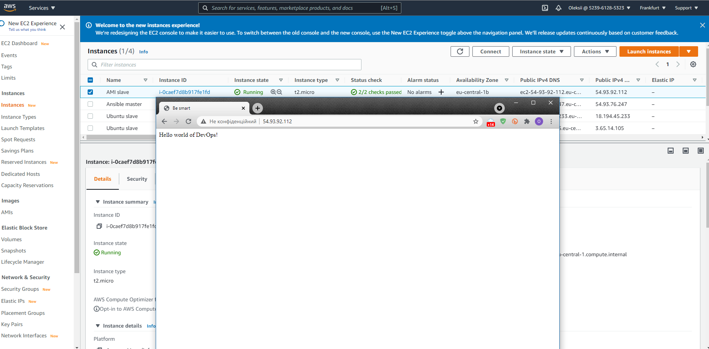

## Task10.1  
For Task 10.1 I created four AWS instances with different OS Linux types and installed Ansible on AWS Ubuntu 20.04 and used playbooks:  
First I created hosts file where I add all aws instances: 
  
Then start playbook1: 
  
Playbook2   
  
Result of installin apache on Ubuntu server in playbook3a: 
  
Instaled apatche server on AMI Linux in playbook3b:  
  
Instaled apatche on different OS type by using OS type check in playbook3c:  
  
Hello World in playbook_loop1:  
  
Installied Apache on different Linux types and copy index.html into web server into /var/www/html with playbook5:  
  
  
Finaly installed apache web server on different Linux types and copy index.j2 jinja2 template into /var/www/html with playbook5a   :  
  
  