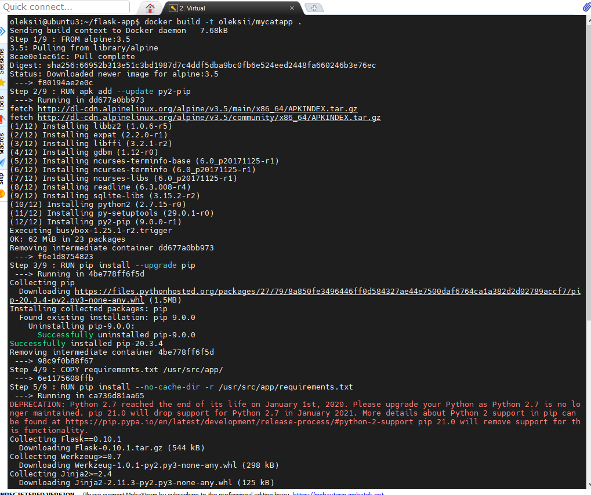

## Task11.1  
For Task 11.1 I installed Docker on VM Ubunto 20.04 and created files Dockerfile, python script file app.py, requirenets.txt and index.html.Then I made docker build from docker file:  
  
  
Finally I started build that shows html page with python script in it, that script choose ramdon cat gif from list of links. Is it important to choose proper links before add them to script.Some links at first may go to captcha page, then docker not will show cat gif.  
  
