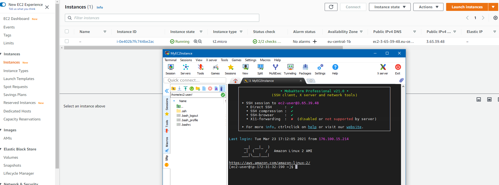
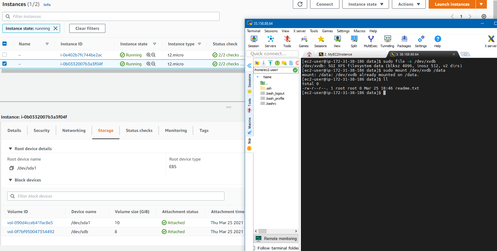
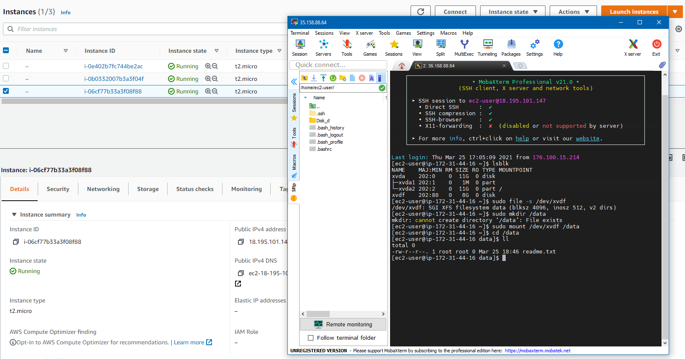
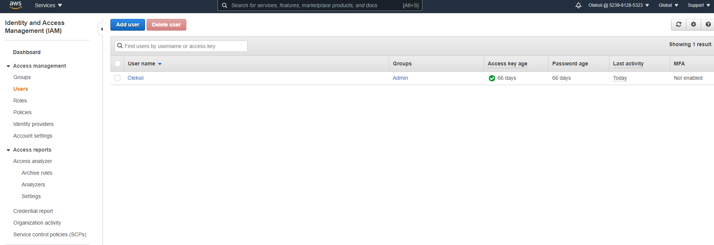
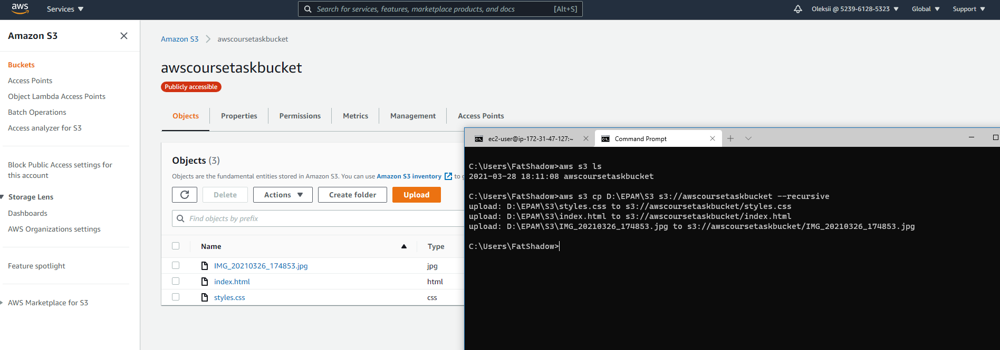
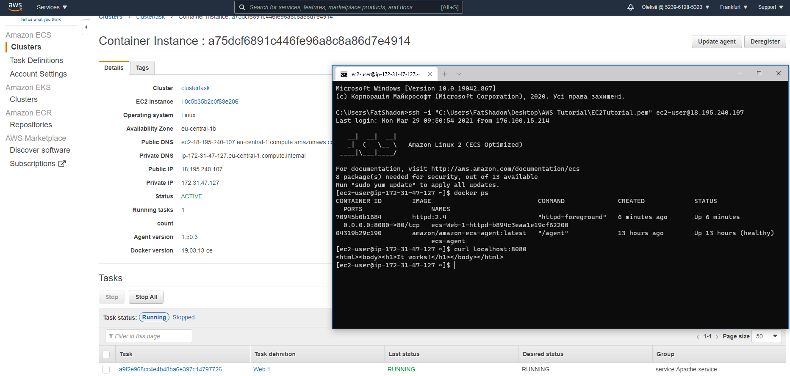

## Task2.2.  
For Task2.2 I registered AWS free tier account and launched instance, and connected to it:
 

 
Then I created and attached EBS  disk to instance and mount disk as folder /data and created fite readme.txt:   
  
Then I created snapshot of my instance and launched second instane using snapshot.After this i detached EBS disk from
first instance and attached to second. Then i mounted it as /data folder:  
  
Then I launched a WordPress instance with Amazon Lighsail usind [tutorial.](https://aws.amazon.com/getting-started/hands-on/launch-a-wordpress-website/?trk=gs_card)  
Created user in AWS IAM:  
  
Then configured CLI AWS created S3 bucket repository and uploaded files to S3:  
  
After this I reviewed [example](https://aws.amazon.com/getting-started/hands-on/get-a-domain/?nc1=h_ls) and explored possibilities of creating domain name and domain name for site with Route 53 
Then I created cluster using Amazon Elastic Container Service and deployed docker with web server Apache from [Docker Hub:](https://hub.docker.com/_/httpd?tab=description&page=1&ordering=last_updated)    
  

## [S3 Personal Page](http://awscoursetaskbucket.s3-website.eu-central-1.amazonaws.com)
