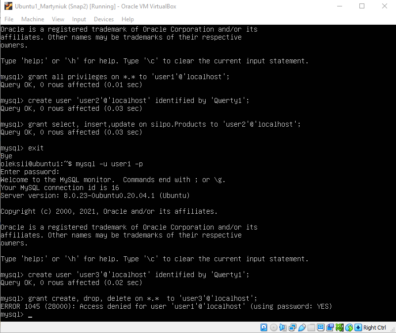

## Task3.1  
For Task3.1 I installed MySql on Ubuntu VM and created Database "Silpo" with tables "Products" and filled in tables.Then I used SELECT operator:
 

 
Then I created new users and grant them different permissions:   
  
  
Then I made selection from the main DB:  
  
Then I made backup of my database to local folder using "mysqldump", deleted data from table and restored base from backup:  
  
  
After this I created base in Amazon RDS and transfered local database to RDS: 
  
  
Then I made backup base from RDS to local Ubuntu VM:  
  
### DynamoDB  
This task i made usind lab from qwikilabs portal. I created Table "Music", fill it and Query table using Query and Scan:  
  
  
  
  
