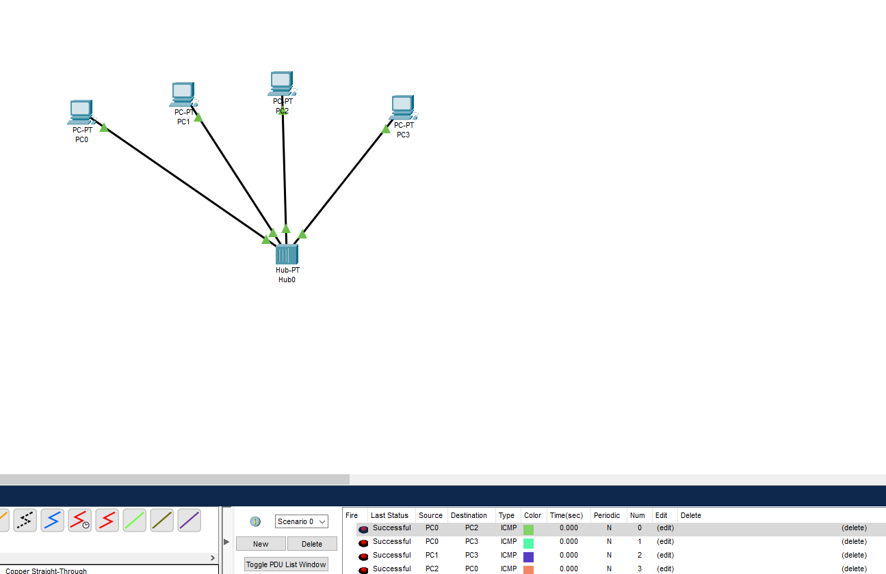
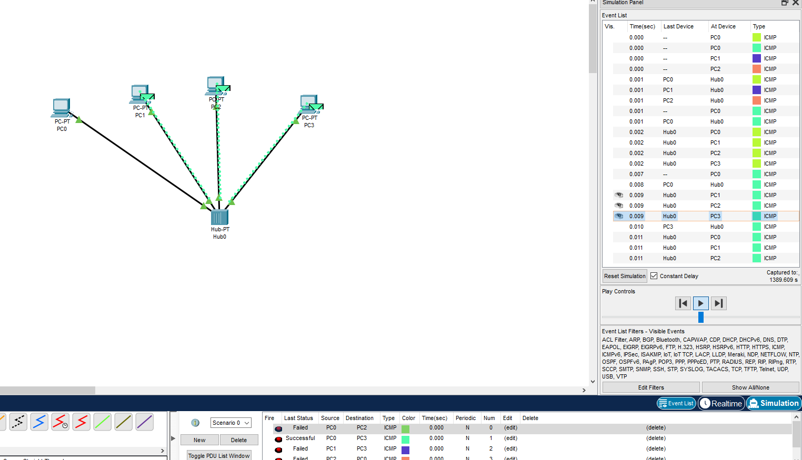
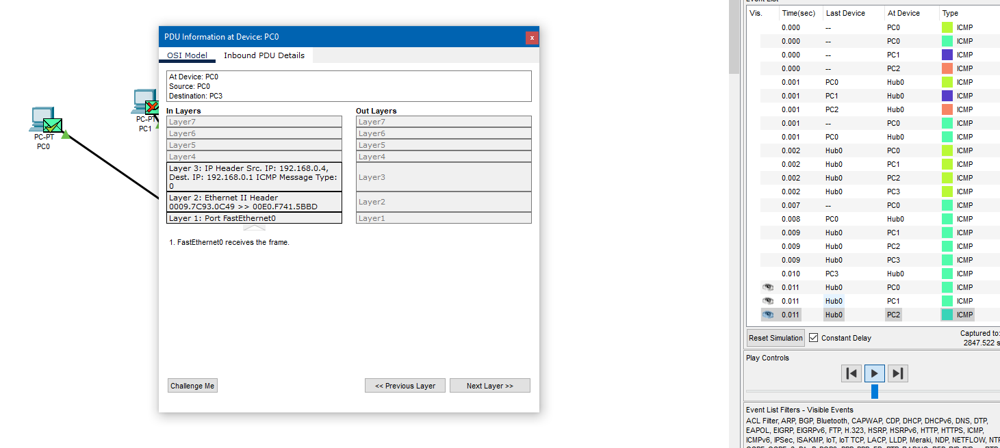
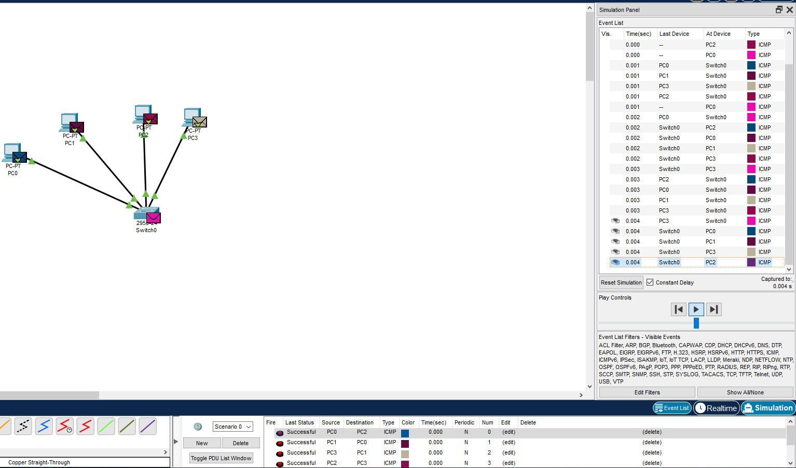
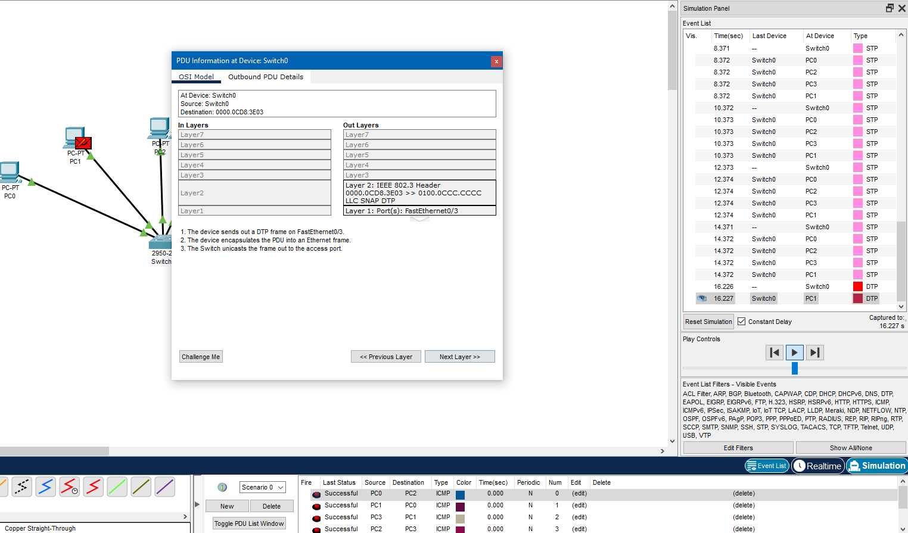
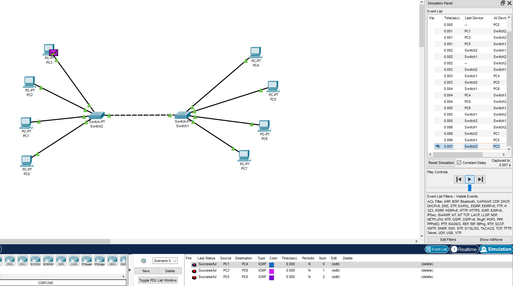
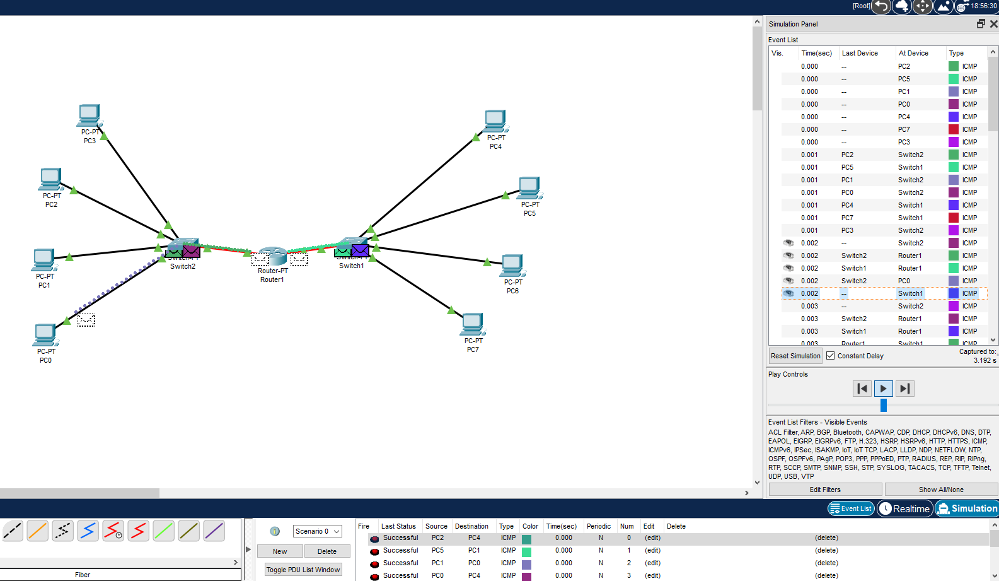

## Task4.1  
For Task4.1 I installed Cisco Packet Tracer made simple project witch contain 4 PC and Hub-PT. Every PC connected with Hub-PT by Copper Straght-through:
 

 
Then for every PC I add unique IP adress and checked how new LAN netword works by sending ICMP packets and reading information on simulation panel :   
  
  
Then I changed Hub-PT for Switch and repeated sending ICMP packets through network:  
  
  
Then I developed this network to new project that include 8 PC and 2 Switches. All this PCs are in one network.After this I tested connection:  
  
Then I separate network into two diferent subnetworks that connected by Router-PT : 
  
In the end I find that Router helps successfuly connect two different subnetworks. 
