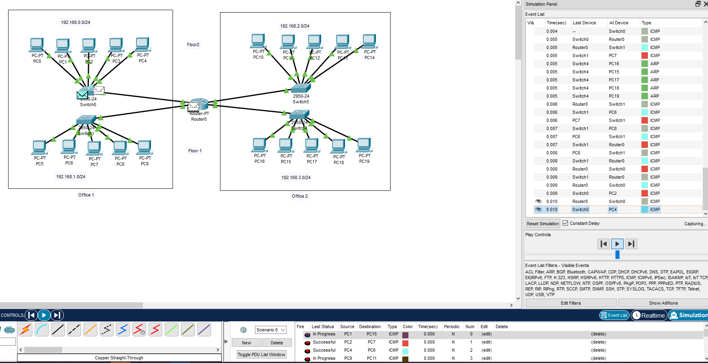
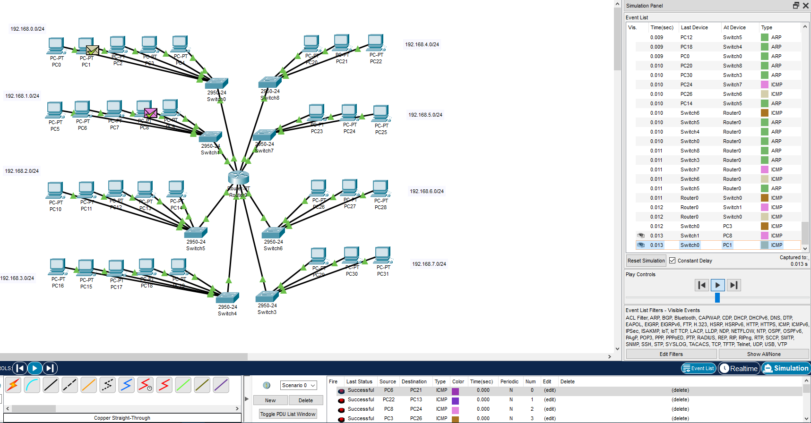
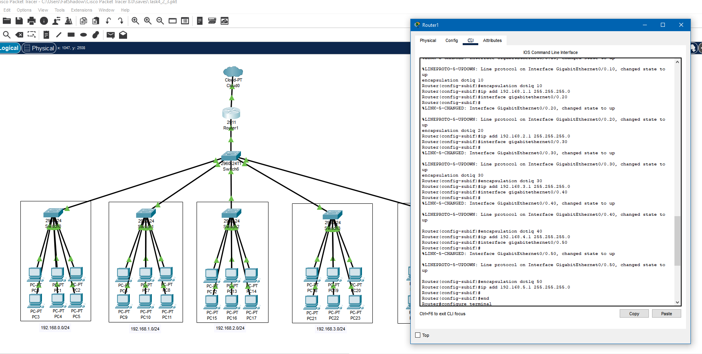
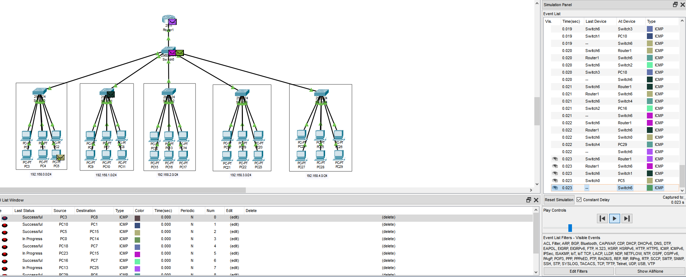
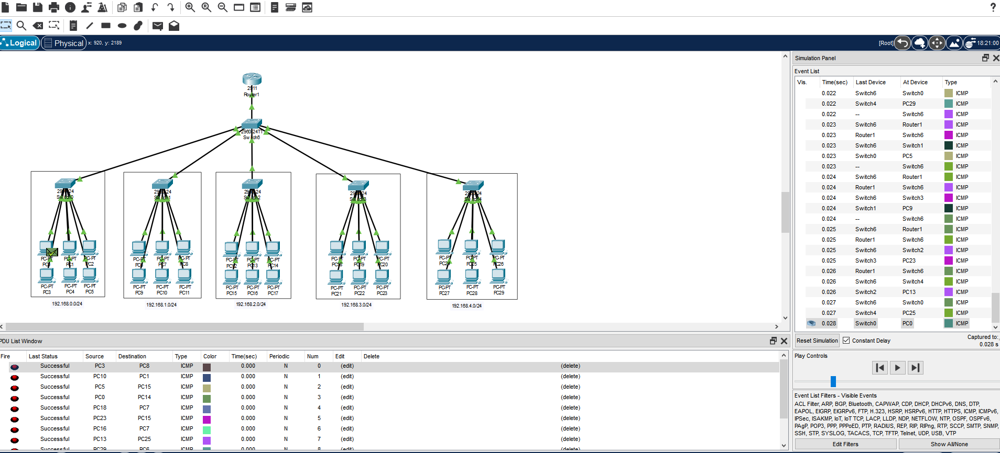
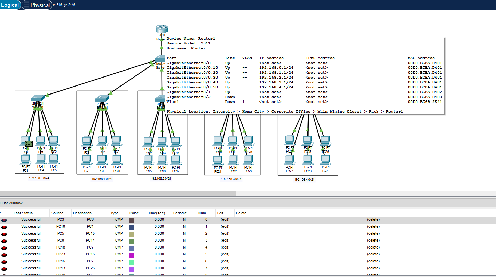

## Task4.2  
For Task4.2 I created network model that include two buildings with two floors each.Horizontal subsystem of the floor consist of one workgroup of five PC:
 

 
Then I modeled and analyzed traffic in corporate network that include one house with four floors.Each floor consist of two workgroups with five and tree PC:   
  
In next Task I needed to develop a local network with group of five houses with workgroup of six PSs in each. Local network based on Router with one input port. I made this network using vlans for each workgroup of PCs:  
  
  
  
  