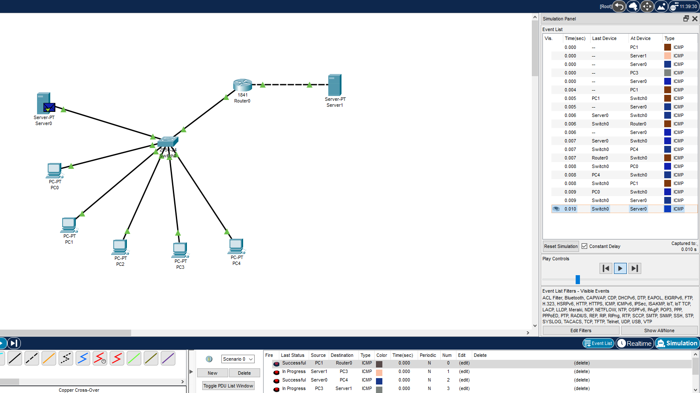
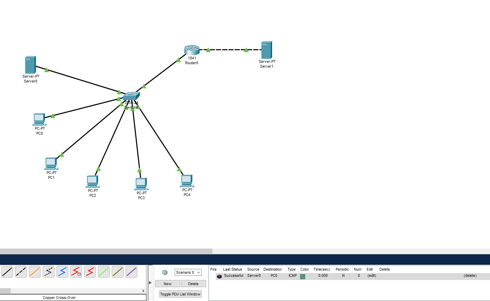
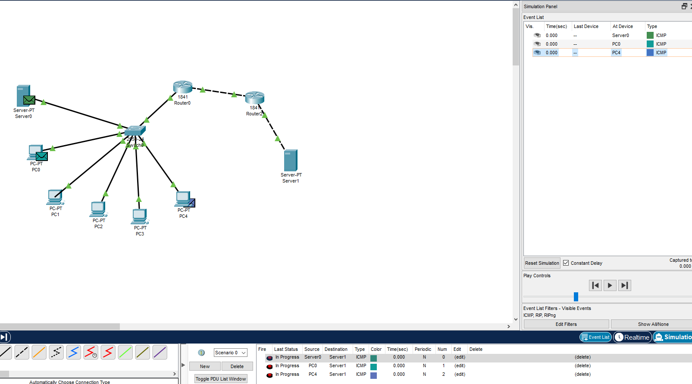
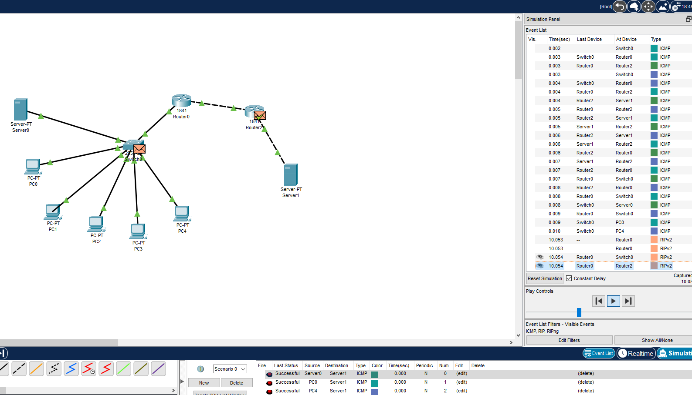

## Task4.3  
For Task4.3 I developed network that consist of five PCs, Switch, two Servers and Router. Then i added ip adresses to PCs in range 192.168.0.x and for Server 1 that connected to Router 192.168.1.1, subnet mask 255.255.255.0.Then I configured Router interfaces and turned them on.After this I configured RIP protocol on Router.But Server 1 still cant connect to netword behind Router:
 

 
  
After this I added second Router and configured interfaces with RIP protocol on second Router, then analyzed connection:  
  
  
Connection successful. 
