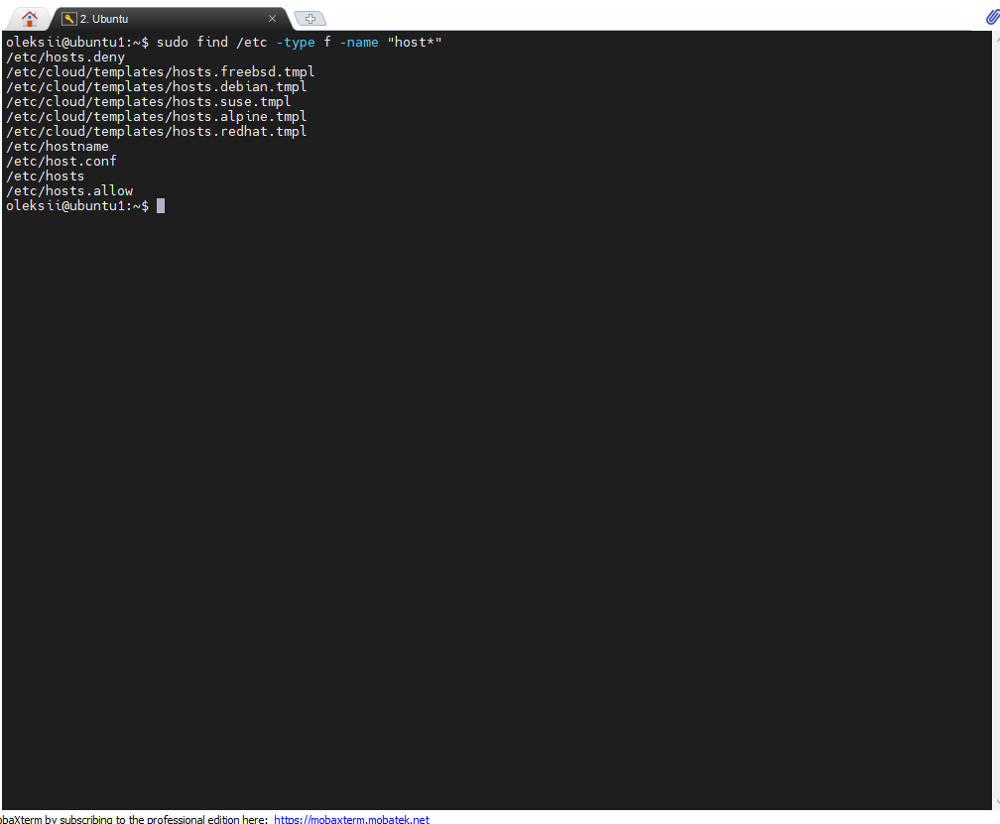
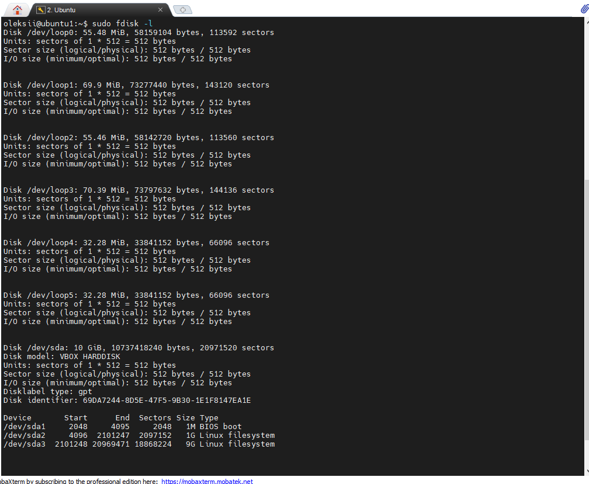

## Task5.1  
### Part 1  
1
Command passwd change info in /etc/passwd and /etc/shadow files:
 

 

 
2 
  
3 For show and changing personal info I used finger and chfn commands:  
  
4 For help command I used ls, key -l shows full information about files in folder and -a shows files with . in folder:  
  
5   
  
  
6 Plan  
  
7 List home directory:  
  

### Part 2  
1 Tree command: 
  
  
  
2 Filetype:  
  
3 Relative path and absolute path:  
  
4 ls 
  
5  
  
6 Symbol link and hard link:  
  
7 Locate:
  
8 Mount:
  
9 Count the number of lines containing a given sequence of characters in a given file using "grep":  
  
10 Find command: 
  
11 List all objects in /etc that contain the ss character sequence:   
  
12 Content of the /etc directory:  
  
  
  
13 There are Block, Character and Pseudo-devices:  
   
  
14 File types in system can be determine by file type mask like *.txt or *.avi: 
  
15  
  