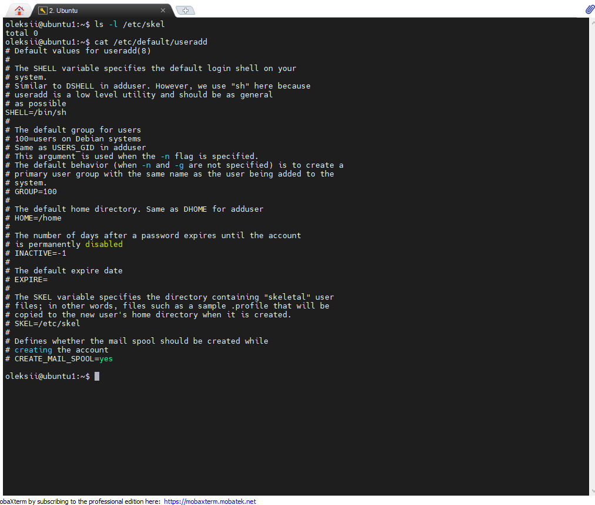

## Task5.2  
1 <em> Analyze the structure of the /etc/passwd and /etc/group file, what fields are 
present in it, what users exist on the system? Specify several pseudo-users, how 
to define them? </em>  
In file etc/passwd there is list of users demons and pseudo-users.Pseudo-userd are used for are not registered in sysytem and needed to confirm ownership of the processes. In the file etc/group conatains list of groups, passwords in ecrypted form and group_id. Pseudo-users can be defined by "nologin" or no /bin/bash in the end of path:
 

 

 
2  <em >What are the uid ranges? What is UID? How to define it? </em>  
UID is used to determine which system resources a user can access. It can be determine in etc/passwd file. Static  system user IDs range from 0 to 99:  
  
3 <em> What is GID? How to define it? </em>  
GID are the group IDs. It can be determine in etc/group file:
  
4 <em> How to determine belonging of user to the specific group? </em>   
Belonging of user to specific group by using command:   
  
5 <em> What are the commands for adding a user to the system? What are the basic 
parameters required to create a user? </em>  
To add new user needed root privileges:  
  
6 <em>  How do I change the name (account name) of an existing user? </em>  
Usermod:  
  
7 <em>What is skell_dir? What is its structure?</em>  
Skel_dir used for initiate home user directory when a user first created.There is saple file /etc/default/useradd that defines the skel directory:  
  
8 <em>How to remove a user from the system (including his mailbox)? </em> 
For deleting user including his mailbox need touse userdel command:
  
9 <em>What commands and keys should be used to lock and unlock a user account?</em>  
For lock and unlock user account used usermod -L and -U keys  
  
10 <em>How to remove a user's password and provide him with a password-free 
login for subsequent password change?</em>  
For remove password for user use passwd with -d key:  
  
11 <em>Display the extended format of information about the directory, tell about 
the information columns displayed on the terminal.</em> 
In extended information about directory first colum is access right to folder, then directory owner,directory group, directory size, date and time and directory name:
   
12 <em>What access rights exist and for whom (i. e., describe the main roles)? 
Briefly describe the acronym for access rights.</em> 
There are read, write and execute rights in system for files and folder.For example 
-rwxr-xr-x:  
   
13 <em>What is the sequence of defining the relationship between the file and the 
user?</em> 
User can be owner of the file and have full access to file.
   
14 <em>What commands are used to change the owner of a file (directory), as well 
as the mode of access to the file? Give examples, demonstrate on the terminal.</em> 
For changing user permission and file owner there are commands chmod and chown:  
   
15 <em>What is an example of octal representation of access rights? Describe the umask command. </em> 
Umask command is used to assign the default file permission sets for newly created folders and files.Then we use umask command it show access rights for new files in octal representation 
   
16<em> Give definitions of sticky bits and mechanism of identifier substitution. Give 
an example of files and directories with these attributes.</em> 
Sticky bits used to avoid deletion of a folder with content or file.
   
17 <em>What file attributes should be present in the command script?</em> 
File must start from #!/bin/bash, have name *.sh and access rights +x.   
   