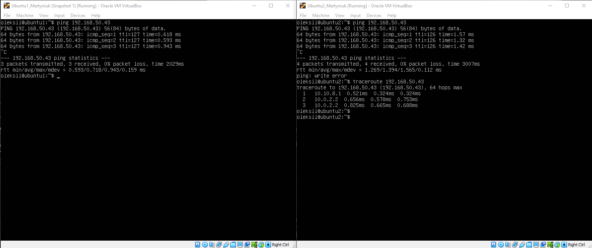
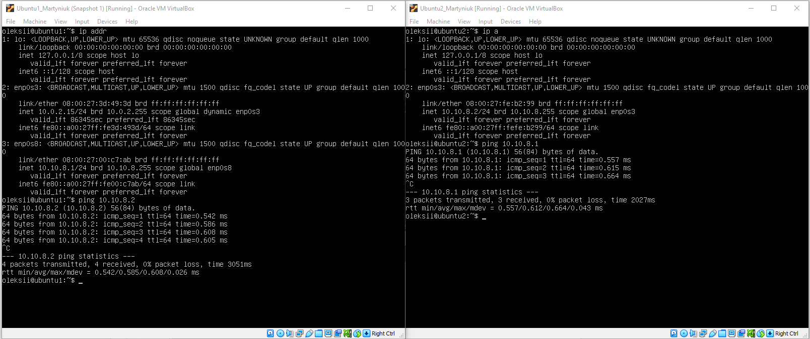
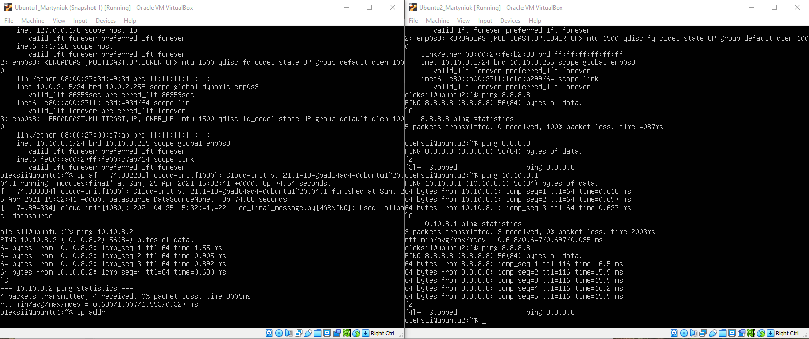
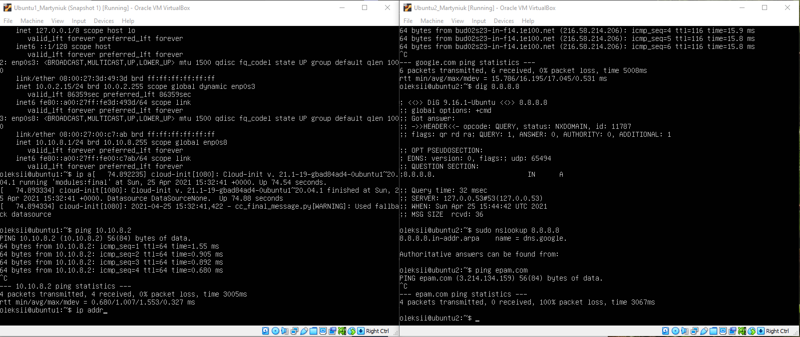
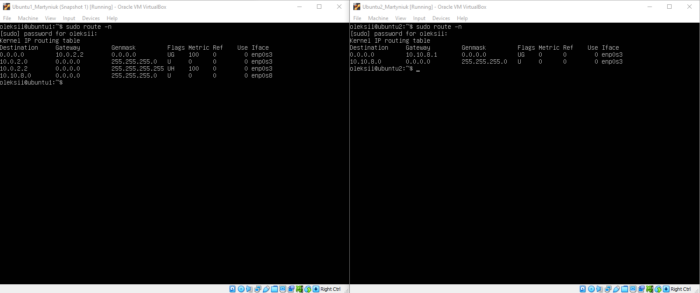
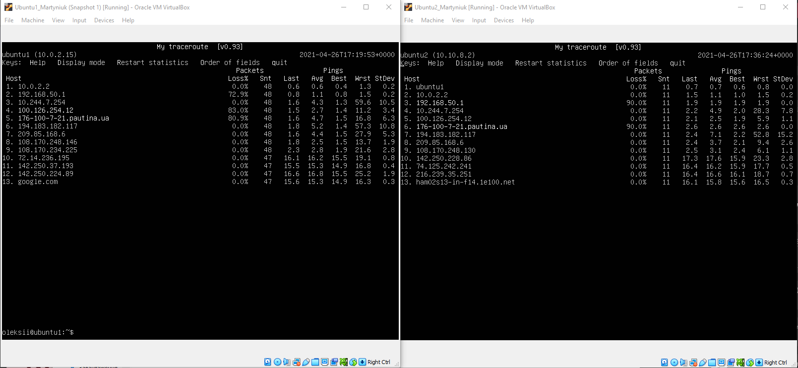

## Task6.1  
1 <em>VM2 has one interface (internal), VM1 has 2 interfaces (NAT and internal). Configure all network
interfaces in order to make VM2 has an access to the Internet (iptables, forward, masquerade).</em> 
On MV1 i configured netplan for local network and set local ip address.On VM2 I configured netplan and set ip address for internal network with gateway ip VM1. Then on VM1 I used commands "sudo iptables -t nat -A POSTROUTING -o enp0s3 -j MASQUERADE" and "sudo iptables -A FORWARD -i enp0s8 -o enp0s3 -m state --state RELATED,ESTABLISHED -j ACCEPT" for routing internal network to internet. 
2 <em>  Check the route from VM2 to Host.</em> 

3 <em> Check the access to the Internet, (just ping, for example, 8.8.8.8). </em>  
  
4 <em>Determine, which resource has an IP address 8.8.8.8. </em> 

5 <em>Determine, which IP address belongs to resource epam.com  

6 <em>Determine the default gateway for your HOST and display routing table</em> 
  
7 <em>Trace the route to google.com </em>  
  
