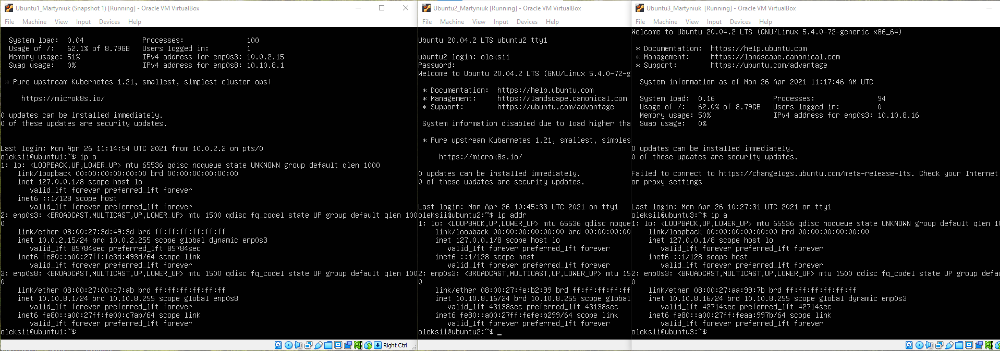
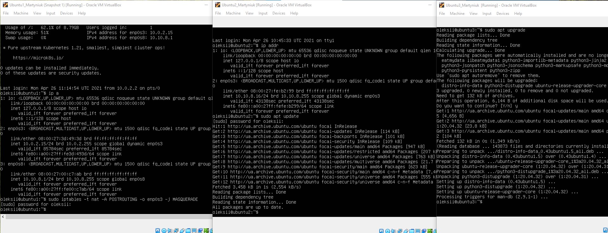
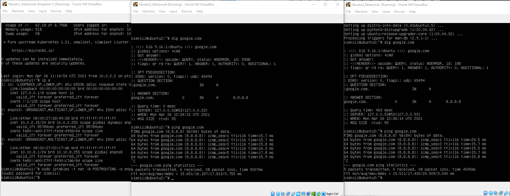
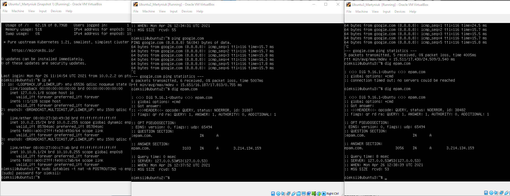

## Task6.2  
1 <em>Use already created internal-network for three VMs (VM1-VM3). VM1 has NAT and internal, 
VM2, VM3 – internal only interfaces.Install and configure DHCP server on VM1. 
(3 ways: using VBoxManage, DNSMASQ and ISC-DHSPSERVER).
 </em>  
On MV1 i configured netplan for local network and set local ip address. Then Installed dnsmasq and configured DHCP and DNS servers. On VM2 and VM3 I in "netplan" set dhcp auto configuration to true. Then on VM1 I used commands "sudo iptables -t nat -A POSTROUTING -o enp0s3 -j MASQUERADE" for routing internal network to internet. 
2 <em>  Check VM2 and VM3 for obtaining network addresses from DHCP server.</em> 

  
3 <em>Using existed network for three VMs (from p.1) install and configure DNS server on VM1. (You can 
use DNSMASQ, BIND9 or something else). Check VM2 and VM3 for gaining access to DNS server (naming services). </em>  
  

