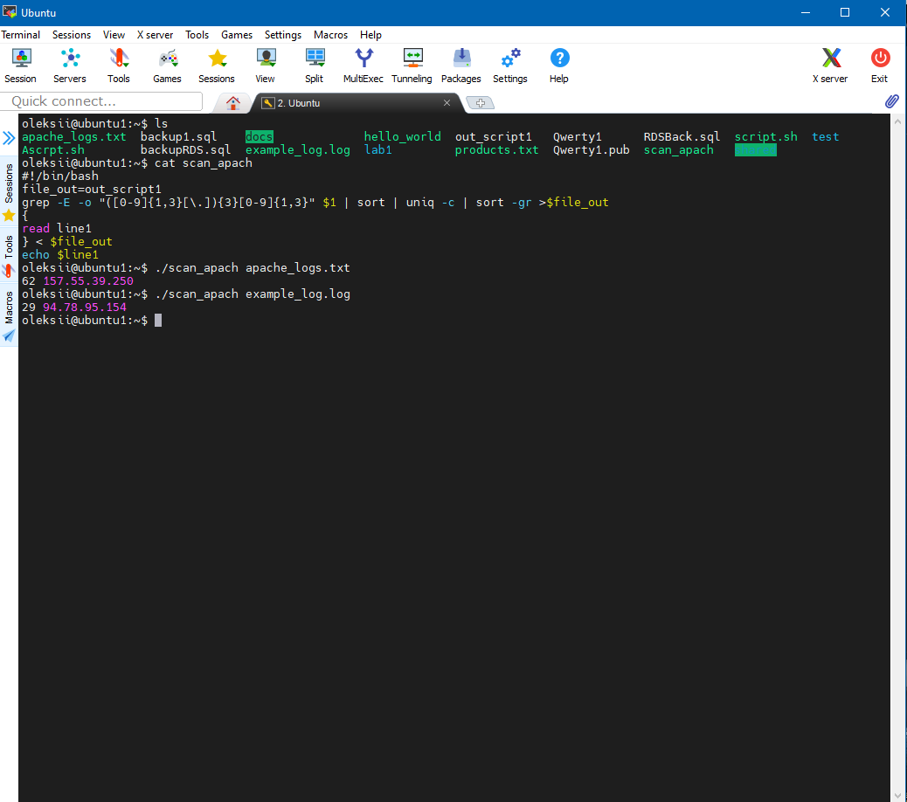
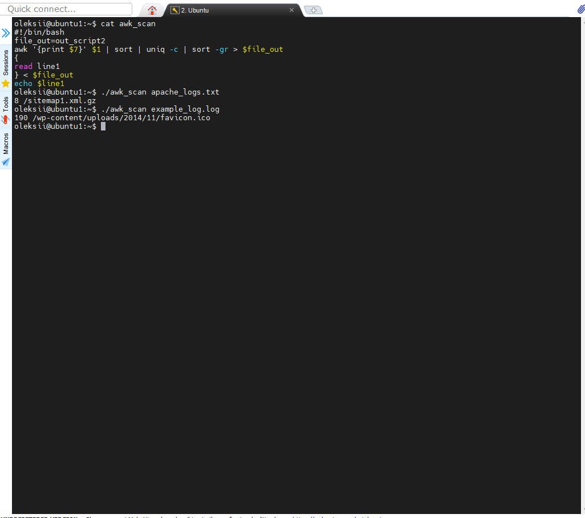
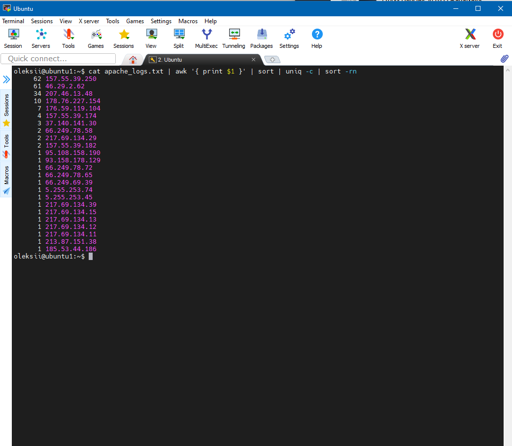
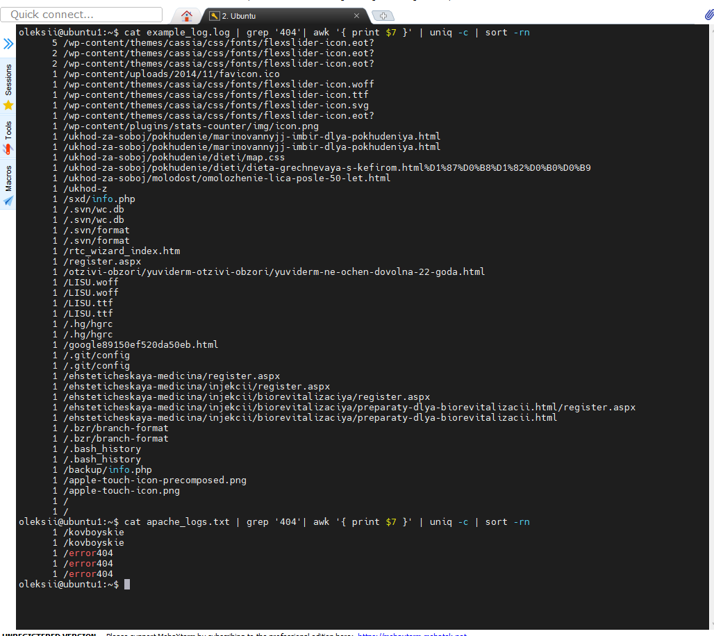
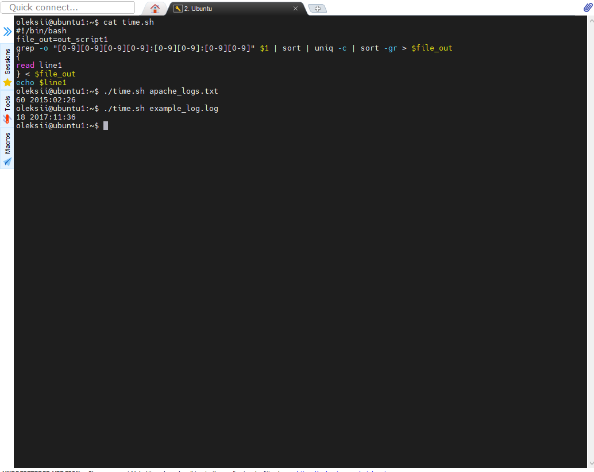
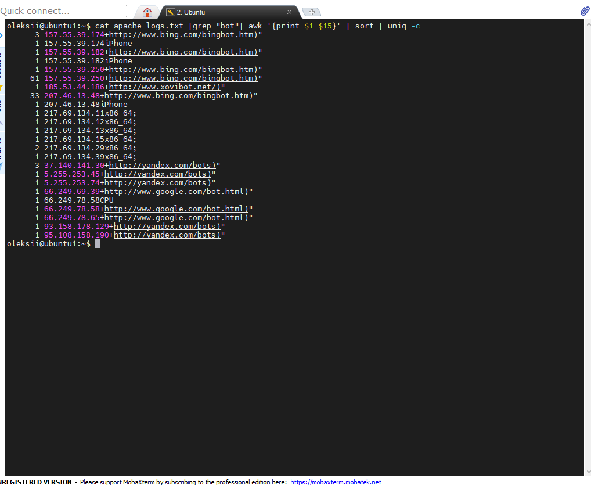

## Task7.1  
1 <em>From which ip were the most requests?
 </em>  

2<em>What is the most requested page?
 </em>  
  
3 <em>How many requests were there from each ip? </em>  
  
4 <em>What non-existent pages were clients referred to?</em>  

5 <em>What time did site get the most requests?</em>  

6 <em>What search bots have accessed the site? (UA + IP)</em>  

