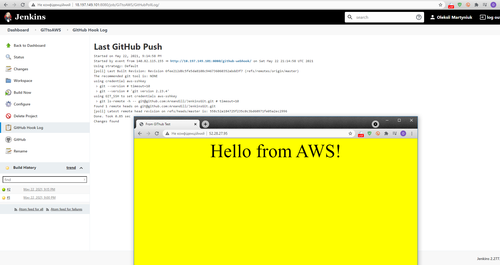

## Task8.1  
For Task 8.1 I installed Jenkins on VM Ubunto 20.04:  
  
  
Then I made first build  
  
Then I installed apache server on second VM Ubuntu 20.04, gave all permissions to directory /var/www for Jenkins, configured ssh connection and made new build:
  
Then I installed open ssh module for Jenkins and configured it and made new build:  
  
Then I configured ssh connection with GitHub, created new repository and pushed new html file:  
  
Then I add periodical checking Git repo for new changes:  
  
Finnaly I created two aws instances, one Amazon Linux with Jenkins and second Ubuntu 20.04 with Apache web server:  
  
After this I configured ssh connections between Jenkins and Web server and between Jenkins and GitHub.Then I configured GitHub hook with my repo for Jenkins and pushed changed hmtl file to GitHub server:  
  